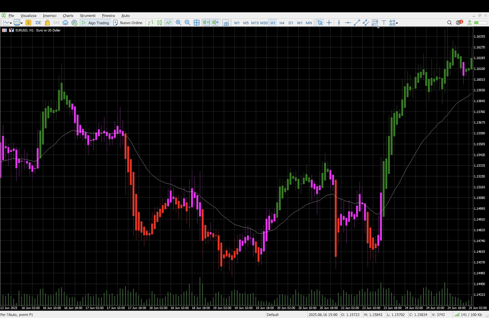
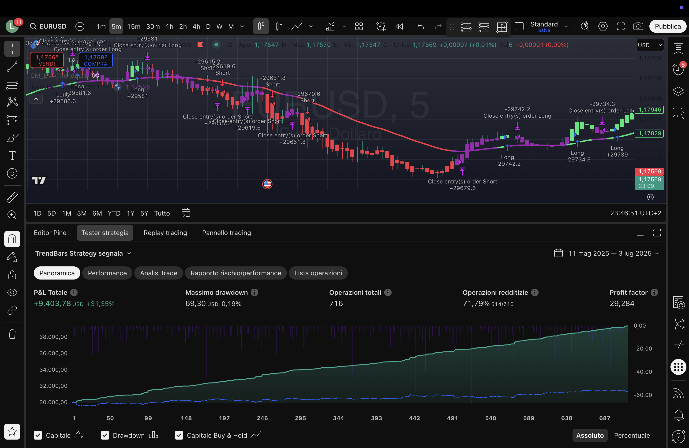
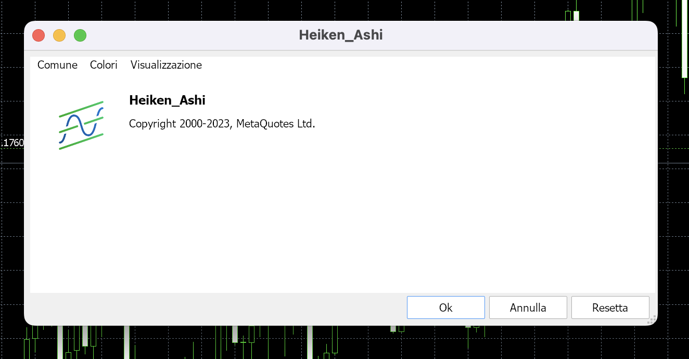
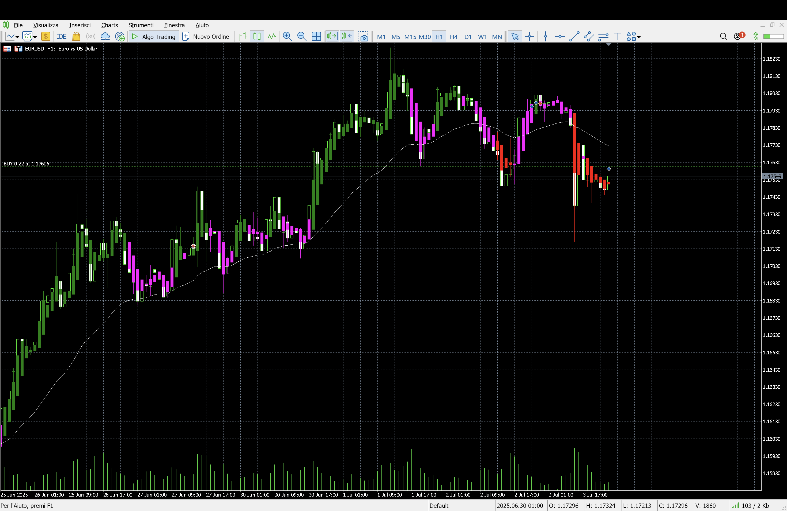
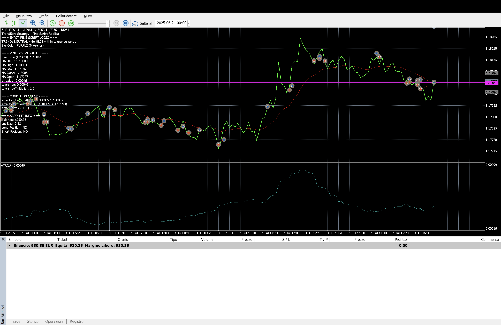

# Da TradingView a MT5: il contesto

TradingView offre uno degli ambienti migliori per lo sviluppo e il test di strategie tramite Pine Script, ma ha dei limiti importanti:
- Non consente trading automatico diretto su conti reali.
- È più orientato all’analisi visuale che all’automazione.

MetaTrader 5, invece, è la piattaforma di riferimento per il trading automatico su Forex e CFD, grazie alla sua flessibilità e alla possibilità di utilizzare Expert Advisor programmati in MQL5.

# La Strategia: TrendBars su base EMA, ATR e HLC3

La strategia TrendBars nasce da una semplice idea: colorare le barre in base alla deviazione della media HLC3 (media di High, Low e Close) rispetto a una EMA (media mobile esponenziale) dinamicamente "ampliata" da una banda di tolleranza calcolata tramite ATR (Average True Range) e un moltiplicatore.

Le regole operative sono:
- **Long** se HLC3 > EMA + tolleranza
- **Short** se HLC3 < EMA - tolleranza
- **Flat/chiusura** se HLC3 rientra nella banda neutrale tra EMA - tolleranza ed EMA + tolleranza

Le uscite sono sempre "a mercato", senza target o stop fisso.

---

# Specifiche operative

Per la mia applicazione pratica ho scelto:
- **Strumento:** EUR/USD
- **Capitale iniziale:** 1000 USD
- **Leva:** 1:30
- **Volume fisso per operazione:** 30000 USD (0.3 lotti standard su EUR/USD)
- **Commissione:** 0,00006 USD per unità (da confrontare e adattare in base al broker MT5)
- **Margine massimo impegnato:** 100% del capitale
- **Timeframe:** 5m
- **Grafico:** Heikin Ashi (come su TradingView)
- **Piattaforma:** MT5 installato su MacBook Air M3 tramite Wine

---

# La conversione: da Pine Script a MQL5

## 1. Analisi e porting della logica

Ho analizzato il Pine Script originale, identificando i punti chiave:
- Calcolo EMA e ATR su dati regolari
- Calcolo HLC3 e condizioni di trend su dati Heikin Ashi
- Gestione dinamica della banda di tolleranza
- Selezione e visualizzazione colore barre
- Regole di ingresso/uscita e gestione delle posizioni

## 2. Scrittura dell’Expert Advisor in MQL5

Ho realizzato un EA che:
- Replica fedelmente la logica del Pine Script (incluso il calcolo di Heikin Ashi su OHLC standard, poiché su MT5 non esiste un vero e proprio grafico Heikin Ashi, ma un’indicatore a parte)
- Gestisce la dimensione fissa dell’ordine, espressa in percentuale rispetto al capitale, e verifica i requisiti di margine prima di ogni operazione
- Mostra sul grafico tutte le informazioni utili: trend, valori EMA, ATR, tolleranza, colore barra, stato posizioni, ecc.
- Consente di visualizzare la EMA colorata, le bande di tolleranza e tutte le condizioni di ingresso/uscita

## 3. Adattamento alle condizioni del broker MT5

Essendo i parametri di marginazione e commissione diversi tra Capital.com (usato in TradingView) e il mio nuovo broker MT5, ho inserito nel codice la possibilità di modificare facilmente:
- **Commissione**
- **Calcolo del margine**
- **Dimensione minima/massima del lotto**

## 4. Problemi di Visualizzazione su MT5

- Innanzitutto non esiste la possibilità di visualizzare il grafico Heiken Ashi, se non tramite un indicatore. 
  

- L’Expert Advisor che ho sviluppato non è in grado di disegnare a grafico le candele Heikin Ashi modificate, perciò per la visualizzazione ho dovuto creare un’indicatore separato
  
  
  Per una migliore visualizzazione ho disattivato la visualizzazione del grafico, impostando il grafico ‘linea’ e poi selezionando il colore ‘none’ tramite le proprietà del grafico.
  
- Siccome indicatore (visualizzatore) e strategia sono separati, non sarà possibile visualizzare il grafico Heikin Ashi modificato durante la simulazione del backtest.
  

--- 

---

## Installazione e test

**Installazione su MacBook Air M3**: MT5 funziona perfettamente tramite Wine. Ho compilato l’EA in MetaEditor, l’ho caricato sul grafico EUR/USD (Heikin Ashi), impostato i parametri richiesti e attivato il trading algoritmico.

**Backtest**: Ho testato la strategia tramite il tester di MT5, impostando capitale, leva, commissioni e condizioni identiche a quelle di TradingView. In questo modo ho potuto verificare la corrispondenza tra i risultati ottenuti sulle due piattaforme.